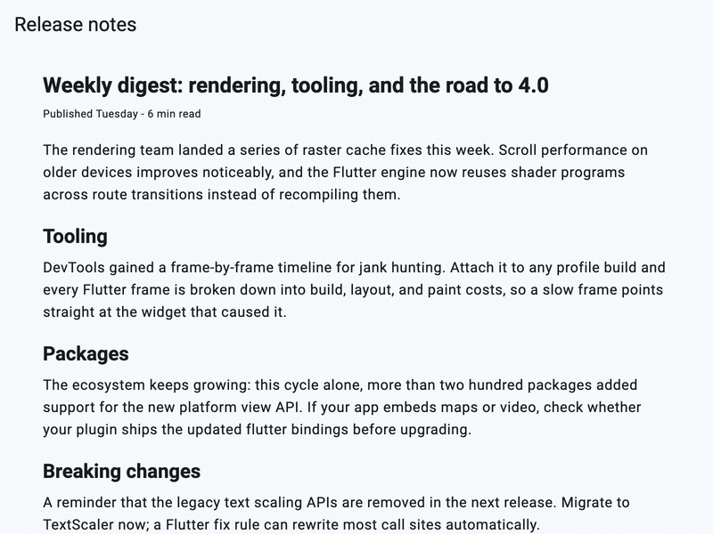

# find_in_page

Ctrl+F for Flutter. Highlight search matches across your widgets, navigate
between them, and scroll the active match into view.

Flutter has no built-in find-in-page ([flutter#65504]). This package adds
one with an opt-in model: wrap the page in a scope, use `FindableText`
where content should be searchable, and the browser-style find bar works.

[flutter#65504]: https://github.com/flutter/flutter/issues/65504

```dart
import 'package:find_in_page/find_in_page.dart';

FindInPageScope(
  child: SingleChildScrollView(
    child: Column(
      children: [
        FindableText('Long article text...'),
        FindableText('More paragraphs...'),
      ],
    ),
  ),
)
```

Press Ctrl+F (Cmd+F on macOS) to open the find bar; type to highlight
every match; Enter or the arrow buttons move between matches, scrolling
each one into view; Escape closes and clears.

## Demo



## Parts

| Class | Role |
|---|---|
| `FindInPageScope` | Provides the controller, handles Ctrl+F / Escape, overlays the bar |
| `FindableText` | `Text` replacement that registers its content and renders highlights |
| `FindBar` | The search bar widget, usable standalone for custom placement |
| `FindInPageController` | Query, matches, and navigation; drive it directly for custom UIs |
| `FindableSource` | Interface to make any custom widget searchable |

## Custom UI

The scope's built-in bar is optional. Drive everything yourself:

```dart
final controller = FindInPageController();

FindInPageScope(
  controller: controller,
  showBar: false,
  child: ...,
);

// Anywhere:
controller.search('flutter');   // highlights all matches
controller.next();              // moves and scrolls to the next one
print('${controller.activeMatchIndex! + 1}/${controller.matchCount}');
```

Highlight colors are per-widget: `FindableText(highlightColor: ...,
activeHighlightColor: ...)`.

## Custom searchable widgets

Implement `FindableSource` in a `State` and register it:

```dart
class _MyWidgetState extends State<MyWidget> implements FindableSource {
  @override
  String get findableText => widget.caption;

  @override
  BuildContext? get findableContext => mounted ? context : null;

  // register in didChangeDependencies, unregister in dispose;
  // read controller.matchesFor(this) to render your own highlights.
}
```

## Limits

- Matching is plain text and case insensitive by default
  (`search(query, caseSensitive: true)` for exact case). Regex is planned.
- Lazily built list items (`ListView.builder`) that have not been built
  yet are not part of the search domain. Content inside
  `SingleChildScrollView`, `Column`, and other built trees is fully
  searchable. A data-driven adapter for lazy lists is planned.
- Match order follows widget build order, which for a normal page is
  top-to-bottom visual order.
- `FindInPageScope` needs an `Overlay` ancestor for its built-in bar;
  every `MaterialApp`/`CupertinoApp`/`WidgetsApp` provides one.
- Navigation scrolls the widget containing the active match into view. In
  a paragraph taller than the viewport the exact line may still be
  offscreen; per-line precision is planned.
- Matches clipped away by `maxLines`/`overflow` are counted and navigated
  to, but cannot become visible.

## License

MIT
